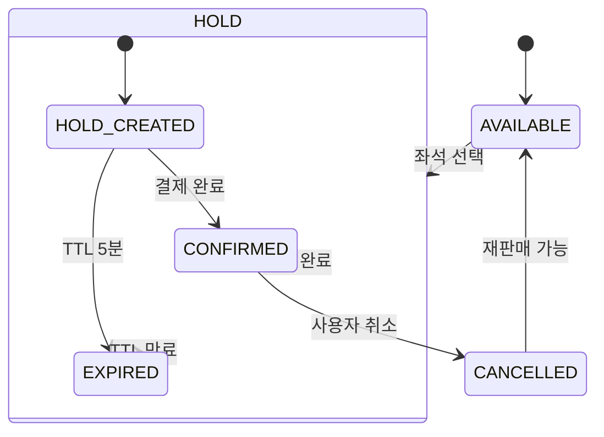

# 콘서트 예약 서비스

## Getting Started
> 대기열 + 좌석 임시배정 + 포인트 충전식 결제 기반의 콘서트 예약 서비스.

### Prerequisites
## 문서
- [주요 시나리오](docs/scenario/scenario.md)
- [API 명세서](./docs/api-spec.yaml)
- [ERD](docs/diagram/erd.md)
- [인프라 구성도](./docs/mvp-infra)
- [시퀀스 다이어그램](docs/diagram/sequence-diagram.md)

## 📝  단계별 정보 정리
| 단계 | 백엔드 입력 | 프론트 출력 | 도메인 규칙 / 제약 |
|------|--------------|--------------|--------------------|
| **콘서트 일정 조회(전체)** | 콘서트 ID(필수) | 콘서트 일정 목록 (캘린더 뷰) | - 해당 콘서트의 판매중(ON_SALE) 스케줄만 반환 |
| **일정 상세 / 잔여 좌석 조회** | 스케줄 ID(필수), 조회 시작/종료일 | 좌석 등급별 잔여 좌석 수, 스케줄 시간, 상태 | - 일정 상태(ON_SALE/CLOSED) 필터링   - 좌석 등급(VIP/R/S) 구분 |
| **대기열 진입** | JWT 토큰, 콘서트 ID, 스케줄 ID | 대기열 순번, 예상 대기 시간, 상태(WAITING/ACTIVE) | - 로그인 필수   - 동일 사용자+스케줄 조합은 1개만 진입 가능   - ACTIVE 상태 TTL(예: 2분) |
| **좌석 조회** | 스케줄 ID | 좌석 번호, 구역, 등급, 가격, 상태 | - 상태(AVAILABLE/HOLD/SOLD_OUT)   - 스케줄별 좌석 Map 형태 반환 |
| **좌석 임시 예약(Hold)** | 스케줄 ID, 좌석 ID, 대기열 토큰, JWT | 좌석 정보(번호/구역/등급/가격), TTL 남은 시간 | - 좌석 Hold TTL(5분)   - 다른 사용자 접근 차단   - **Redisson Lock** 또는 DB 유니크 제약 필요 |
| **결제(포인트/카드)** | 예약 ID, 결제 금액, 결제 수단, Idempotency-Key | 결제 결과(성공/실패), 결제 상세, 예약 상태 | - 멱등성 키 필수 (Idempotency-Key)   - 결제 성공 시 좌석 상태 SOLD_OUT   - 실패 시 트랜잭션 롤백 |
| **포인트 충전** | JWT 토큰, 충전 금액, Idempotency-Key | 충전 완료 메시지, 잔액, 충전 내역 | - 멱등성 키 필수   - 충전 실패 시 이력 롤백 |
| **예약 조회 / 취소** | JWT 토큰, 예약 ID | 예약 상태(임시/HOLD/CONFIRMED/CANCELLED) | - 취소 시 좌석 상태 AVAILABLE 복귀   - 취소 멱등 보장 (중복 취소 허용) |

## 🧩 도메인 상태 전이 (State Machine)

### 🎫 Reservation (예약)
| 상태 | 설명 | 전이 조건 / 이벤트 |
|------|------|-------------------|
| **HOLD** | 좌석 임시 배정 상태 (결제 대기) | `좌석 선택 시` 생성, TTL 5분   → 결제 완료 시 `CONFIRMED`   → TTL 만료 시 `EXPIRED` |
| **CONFIRMED** | 결제 완료, 좌석 확정 | 결제 성공 시 전이 (`PaymentApproved`) |
| **CANCELLED** | 사용자가 예약 취소 | `사용자 취소` or `결제 실패` 시 전이 |
| **EXPIRED** | 임시 배정 만료 | TTL 초과 시 자동 만료 (Redis 만료 or Batch 처리) |

---

### 💺 Seat (좌석)
| 상태 | 설명 | 전이 조건 / 이벤트 |
|------|------|-------------------|
| **AVAILABLE** | 판매 가능 상태 | 최초 상태   또는 예약 취소/만료 시 복귀 |
| **HOLD** | 임시 배정 상태 | `Reservation.HOLD` 시점에 전이   → TTL 만료 시 `AVAILABLE` 복귀 |
| **SOLD_OUT** | 판매 완료 (예약 확정) | `Reservation.CONFIRMED` 시점에 전이 |

> 🔒 좌석 상태 전이는 **Redisson 분산 락** 또는 **DB 유니크 제약**을 통해 동시성 제어  
> 예: `(scheduleId, seatId, status in {HOLD, SOLD_OUT})` 유일성 보장

---

### 🧾 Payment (결제)
| 상태 | 설명 | 전이 조건 / 이벤트 |
|------|------|-------------------|
| **PENDING** | 결제 승인 대기 | 결제 요청 시 생성 |
| **APPROVED** | 결제 완료 | PG 응답 성공 or 포인트 차감 성공 |
| **FAILED** | 결제 실패 | 포인트 부족 / PG 오류 / 타임아웃 등 |
| **REFUNDED** | 결제 취소(환불) | 예약 취소 시 보상 트랜잭션 처리 |

> 💡 결제 요청 시 **Idempotency-Key** 필수  
> → 동일 키 재요청 시 동일 결과 반환 (중복 결제 방지)

---

### 🕓 QueueToken (대기열 토큰)
| 상태 | 설명 | 전이 조건 / 이벤트 |
|------|------|-------------------|
| **WAITING** | 대기 중 | 예매 요청 시 생성, 순번 대기 |
| **ACTIVE** | 예매 가능 상태 | 순번 도착 시 활성화 (TTL 2분) |
| **USED** | 예매 완료 | 좌석 예약 시 전이, 재사용 불가 |
| **EXPIRED** | 대기열 만료 | TTL 초과 시 자동 만료 |

> 🎟️ QueueToken은 **JWT와 별도 개념**이며,  
> **특정 스케줄에 대한 일시적 접근 자격**을 의미함.

---

### 💰 PointWallet (포인트 지갑)
| 상태 | 설명 | 전이 조건 / 이벤트 |
|------|------|-------------------|
| **ACTIVE** | 사용 가능 | 기본 상태 |
| **CHARGING** | 충전 중 | 충전 요청 중 상태, 멱등키 기반 트랜잭션 |
| **CHARGED** | 충전 완료 | 결제 성공 시 반영 |
| **DEDUCTED** | 사용 완료 | 예매 결제 시 포인트 차감 |
| **ROLLBACK** | 환불 처리 | 예매 취소 시 포인트 복원 |

> 💡 포인트 트랜잭션(충전/차감/환불)은 모두 **이력형 Ledger 구조**로 관리하며,  
> **WalletBalance는 집계값**, **WalletHistory는 불변 기록**으로 설계

---

## ⚙️ 상태 전이 요약 다이어그램 (Mermaid)

# 기술
- Java 21, Spring Boot 3, JPA (PostgreSQL), Redis(Redisson), JWT
- 테스트: JUnit5 + Testcontainers

## ADR-001: Nginx 도입 여부 (MVP vs 운영)
## ADR-002: MySQL vs PostGreSQL
- 공통 : 클라우드 환경 적용 용이
- 데이터 정합성, 확실성 PostGreSQL 우수
## ADR-003: Redis 도입 여부
## ADR-004: UUIDv7 ID 생성 전략 선택(JUG vs Hypersistence Utils)
- Hypersistence Utils
- JUG(java-uuid-generator)
### 시스템 목표 
- 현재 대량 트래픽 상황을 가정하고, 스케일 아웃을 고려하는 환경을 목표로 구현한다.

## Context
- 콘서트 예매 시스템은 특정 시간(오픈 시점)에 트래픽 피크가 크게 발생할 수 있다.
- 대기열(`/queues/enter`, `/queues/status`)은 폴링 구조를 가지며, 과도한 요청을 방지할 수단이 필요하다.
- 서버는 Spring Boot 기반 단일 애플리케이션으로 시작하지만, 향후 트래픽 증가 시 수평 확장이 필요할 수 있다.
- 인프라는 AWS EC2 + Redis + PostgreSQL 기반으로 구성한다.

## Decision
- **MVP 단계**
  - 인프라 단순화를 위해 Nginx 없이 **단일 Spring Boot 애플리케이션**이 직접 HTTP/HTTPS 요청을 처리한다.
  - Redis와 PostgreSQL은 각각 대기열/토큰 캐시, 영구 데이터 저장 역할만 담당한다.
- **운영/확장 단계**
  - 서비스 안정성과 확장성을 위해 **Nginx를 프론트에 도입**한다.
  - Nginx는 다음 역할을 수행한다:
    - HTTPS 종료 및 도메인 엔드포인트 통합 (`https://api.concerts.com`)
    - 여러 Spring Boot 인스턴스로의 **로드 밸런싱**
    - `/queues/status` 등 폴링/민감 엔드포인트에 대한 **rate limiting**
    - 향후 서비스 분리 시(예: 예약/결제/포인트 서비스) 경로 기반 라우팅

## Rationale
- MVP의 우선순위는 **도메인 모델링과 기본 기능 구현**이다.  
  초기에는 EC2 한 대, Spring Boot 한 개 프로세스만으로도 기능 검증이 가능하다.
- Nginx는 설정/운영 복잡도를 가져오기 때문에,
  **실제 부하/운영 이슈가 발생할 가능성이 높아지는 시점**에 도입하는 것이 합리적이다.
- 반면, 설계 단계에서부터 Nginx를 전제한 **아키텍처를 그려둠으로써**:
  - 추후 수평 확장,
  - 마이크로서비스 분리,
  - 보안/트래픽 정책(HTTPS, rate limit) 적용
    을 자연스럽게 가져갈 수 있다.

## Consequences
### Positive
- MVP:
  - 인프라 구성이 단순해져 개발/테스트 속도가 빨라진다.
  - 배포 파이프라인도 Spring Boot + DB + Redis만 신경 쓰면 된다.
- 운영:
  - 피크 타임 트래픽을 Nginx 레벨에서 1차 필터링/분산할 수 있다.
  - App 서버는 비즈니스 로직에만 집중하고, 네트워크/SSL/접속제어는 Nginx에 위임한다.
  - `/queues` 처럼 민감한 엔드포인트에 대한 rate limit, IP 차단 등을 중앙에서 관리할 수 있다.

### Negative
- MVP:
  - Nginx가 없으므로,
    - HTTPS 설정을 Spring Boot에서 직접 처리해야 하고,
    - 간단한 rate limit도 코드/필터 수준에서만 처리해야 한다.
- 운영:****
  - 인프라 구성이 Nginx + 다수 App 서버 구조로 복잡해진다.
  - Nginx 설정/모니터링/배포에 대한 추가 운영 비용이 발생한다.

## Alternatives
1. **항상 Nginx 없이 운영**
  - Spring Boot가 직접 HTTPS + 로드 밸런싱 없는 단일 진입점 역할 수행
  - 초기엔 단순하지만, 트래픽 증가 시 확장과 보호가 어렵다.
2. **Cloud LB / API Gateway로 대체 (예: AWS ALB, API Gateway)**
  - Nginx 대신 클라우드 서비스에서 SSL 종료 + 라우팅 + rate limit 처리
  - 인프라/비용 구조가 달라지며, 학습 목표(직접 Nginx 운영)와는 거리가 생긴다.
3. **초기부터 Nginx를 도입**
  - 설계와 구현이 바로 운영형 구조를 따르게 된다.
  - MVP 단계의 복잡도가 올라가고, 학습/실험 속도가 느려질 수 있다.