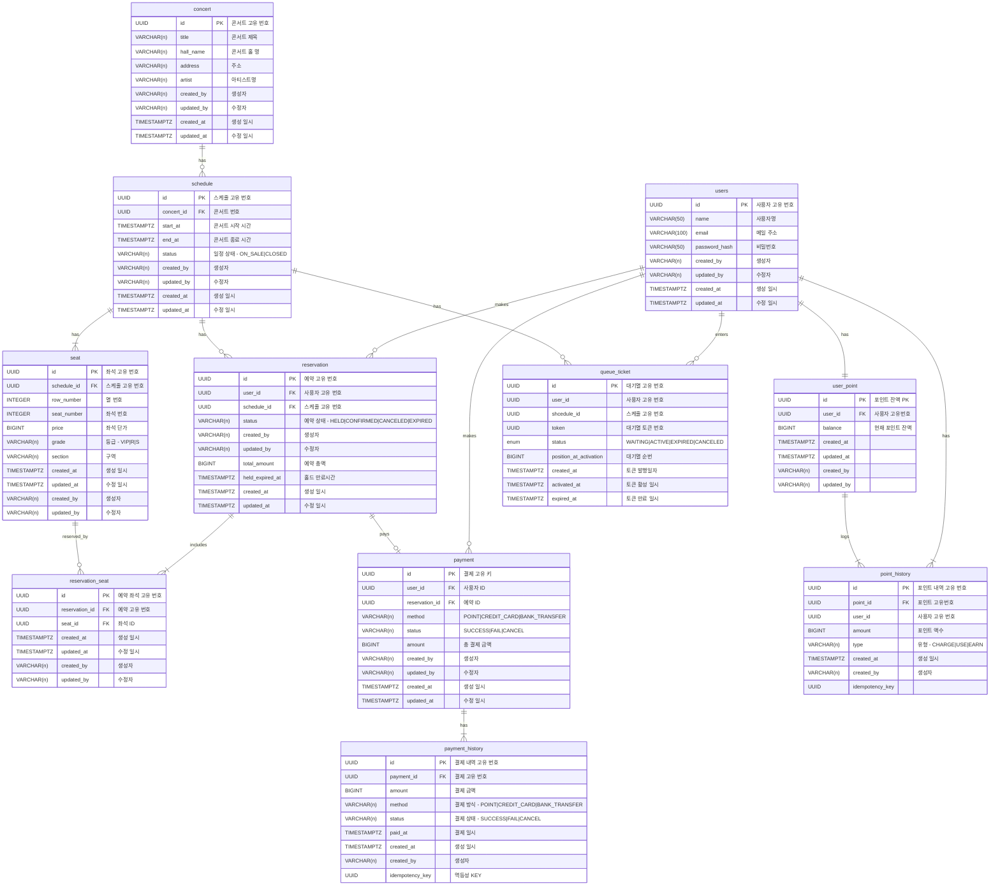

# 콘서트 DB & ERD
-- -

## 모델링 원칙
-- -
### 테이블 history 컬럼
  - 데이터 생성/수정 일시 : createdAt(생성 일시) updatedAt(수정 일시)
  - 액터(사용자/시스템) : createdBy(소유자), updatedBy(수정자)
### PK 관련 규칙 
- 컬럼 자동생성 옵션 지양
- PK 포맷은 UUIDv7을 사용(세부 내용은 ADR-002 참고)
### 기타 컬럼 타입 규칙
- 포인트, 금액 관련 숫자 타입은 BIGINT 통일
- 시간 관련 타입은 TIMESTAMPTZ 통일 
- 상태 값은 VARCHAR 통일 (ENUM 사용 금지! 단, ERD 표기는 편의상 ENUM 으로 표기)
- seat.status 없음, 상태는 reservation / reservation_seat 에서 파생
- payment_history.idempotency_key 는
  동일 결제 요청 재시도 시 응답 재사용을 위한 키이며,
  (payment_id, idempotency_key) 는 유니크해야 한다
## ERD
--- -
