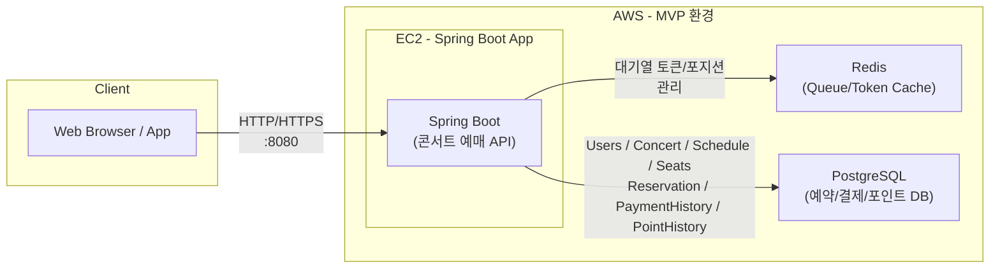

```mermaid
flowchart LR
subgraph Client["Client"]
BROWSER["Web Browser / App"]
end

    subgraph AWS["AWS - MVP 환경"]
        subgraph APP_EC2["EC2 - Spring Boot App"]
            APP["Spring Boot\n(콘서트 예매 API)"]
        end

        REDIS["Redis\n(Queue/Token Cache)"]
        PG["PostgreSQL\n(예약/결제/포인트 DB)"]
    end

    BROWSER -->|"HTTP/HTTPS\n:8080"| APP
    APP -->|"대기열 토큰/포지션\n관리"| REDIS
    APP -->|"Users / Concert / Schedule / Seats\nReservation / PaymentHistory / PointHistory"| PG
```