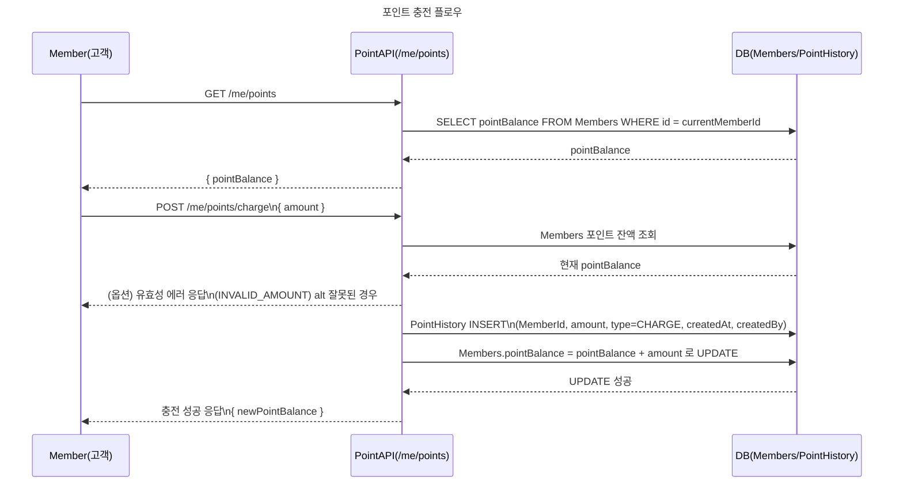
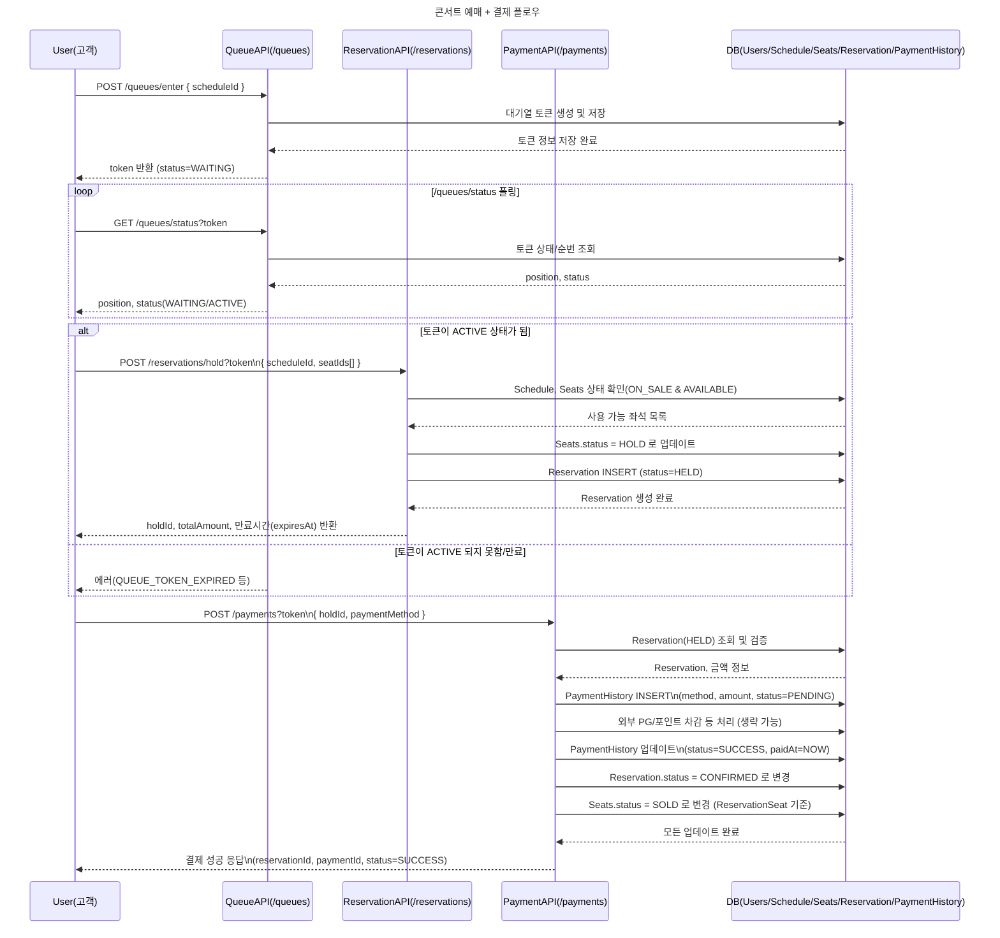

## 포인트 충전 

```mermaid
sequenceDiagram
    title 포인트 충전 플로우

    participant Member as Member(고객)
    participant PointAPI as PointAPI(/me/points)
    participant DB as DB(Members/PointHistory)

    %% 1. 현재 포인트 잔액 조회
    Member->>PointAPI: GET /me/points
    PointAPI->>DB: SELECT pointBalance FROM Members WHERE id = currentMemberId
    DB-->>PointAPI: pointBalance
    PointAPI-->>Member: { pointBalance }

    %% 2. 포인트 충전 요청
    Member->>PointAPI: POST /me/points/charge\n{ amount }
    PointAPI->>DB: Members 포인트 잔액 조회
    DB-->>PointAPI: 현재 pointBalance

    %% 3. 비즈니스 검증 (최소/최대 금액 등)
    PointAPI-->>Member: (옵션) 유효성 에러 응답\n(INVALID_AMOUNT) alt 잘못된 경우

    %% 4. 충전 처리
    PointAPI->>DB: PointHistory INSERT\n(MemberId, amount, type=CHARGE, createdAt, createdBy)
    PointAPI->>DB: Members.pointBalance = pointBalance + amount 로 UPDATE
    DB-->>PointAPI: UPDATE 성공

    %% 5. 최종 응답
    PointAPI-->>Member: 충전 성공 응답\n{ newPointBalance }
    
    
    
```
---
## 좌석 예매 

```mermaid
sequenceDiagram
    title 콘서트 예매 + 결제 플로우

    participant User as User(고객)
    participant QueueAPI as QueueAPI(/queues)
    participant ReservationAPI as ReservationAPI(/reservations)
    participant PaymentAPI as PaymentAPI(/payments)
    participant DB as DB(Users/Schedule/Seats/Reservation/PaymentHistory)

    %% 1. 대기열 진입
    User->>QueueAPI: POST /queues/enter { scheduleId }
    QueueAPI->>DB: 대기열 토큰 생성 및 저장
    DB-->>QueueAPI: 토큰 정보 저장 완료
    QueueAPI-->>User: token 반환 (status=WAITING)

    %% 2. 대기열 상태 폴링 (선택적으로 표현)
    loop /queues/status 폴링
        User->>QueueAPI: GET /queues/status?token
        QueueAPI->>DB: 토큰 상태/순번 조회
        DB-->>QueueAPI: position, status
        QueueAPI-->>User: position, status(WAITING/ACTIVE)
    end

    %% 3. 좌석 홀드(예약 생성)
    alt 토큰이 ACTIVE 상태가 됨
        User->>ReservationAPI: POST /reservations/hold?token\n{ scheduleId, seatIds[] }
        ReservationAPI->>DB: Schedule, Seats 상태 확인(ON_SALE & AVAILABLE)
        DB-->>ReservationAPI: 사용 가능 좌석 목록
        ReservationAPI->>DB: Seats.status = HOLD 로 업데이트
        ReservationAPI->>DB: Reservation INSERT (status=HELD)
        DB-->>ReservationAPI: Reservation 생성 완료
        ReservationAPI-->>User: holdId, totalAmount, 만료시간(expiresAt) 반환
    else 토큰이 ACTIVE 되지 못함/만료
        QueueAPI-->>User: 에러(QUEUE_TOKEN_EXPIRED 등)
    end

    %% 4. 결제 요청
    User->>PaymentAPI: POST /payments?token\n{ holdId, paymentMethod }
    PaymentAPI->>DB: Reservation(HELD) 조회 및 검증
    DB-->>PaymentAPI: Reservation, 금액 정보

    %% 5. 결제 처리 및 상태 업데이트
    PaymentAPI->>DB: PaymentHistory INSERT\n(method, amount, status=PENDING)
    PaymentAPI->>DB: 외부 PG/포인트 차감 등 처리 (생략 가능)
    PaymentAPI->>DB: PaymentHistory 업데이트\n(status=SUCCESS, paidAt=NOW)
    PaymentAPI->>DB: Reservation.status = CONFIRMED 로 변경
    PaymentAPI->>DB: Seats.status = SOLD 로 변경 (ReservationSeat 기준)
    DB-->>PaymentAPI: 모든 업데이트 완료

    %% 6. 최종 응답
    PaymentAPI-->>User: 결제 성공 응답\n(reservationId, paymentId, status=SUCCESS)
```    